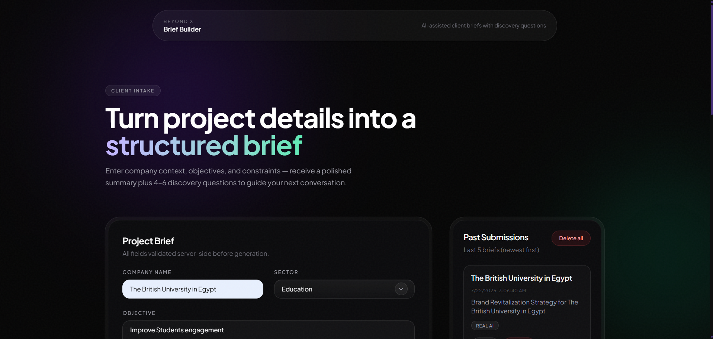
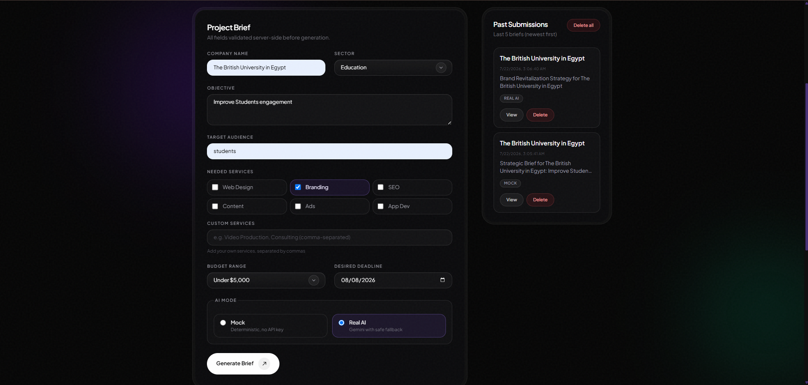
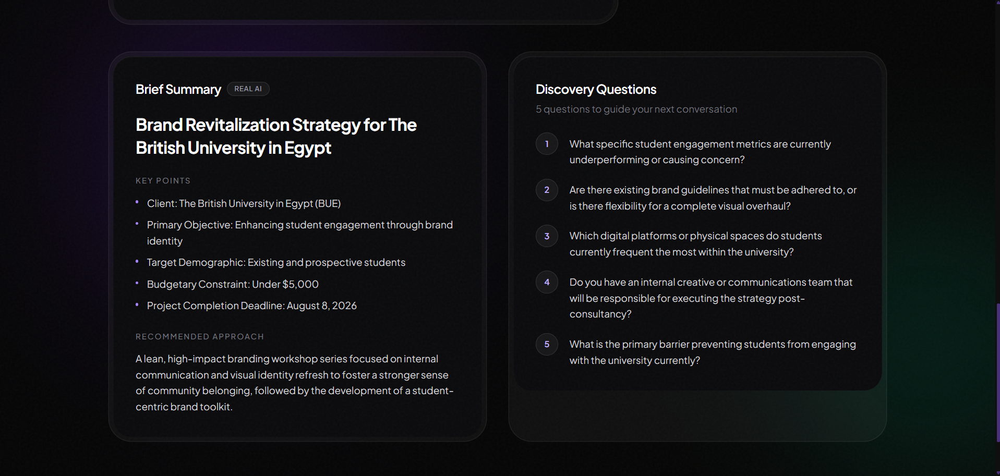
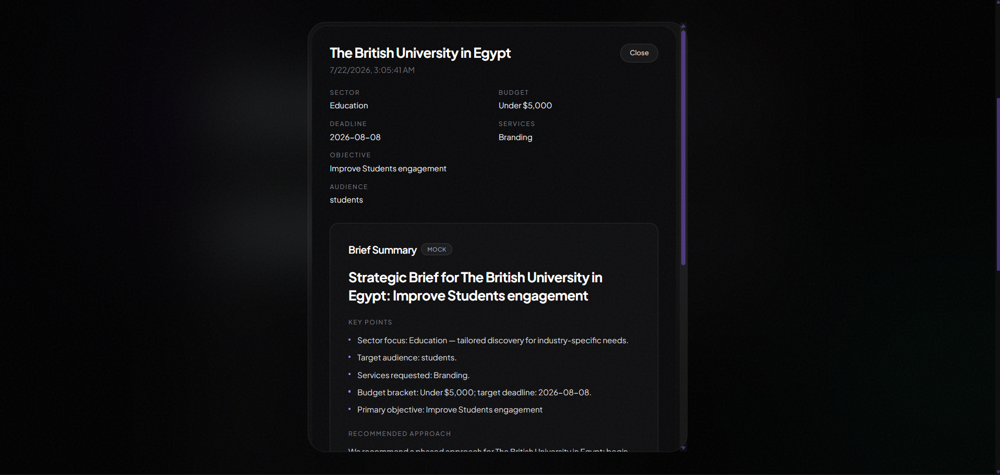

# Beyond X Brief Builder

## Overview

A full-stack prototype for the **Beyond X Full-Stack AI Developer / Web Developer** hiring assessment. Clients enter project details and receive a structured brief summary plus 4–6 discovery questions, powered by a deterministic mock AI provider with optional Google Gemini integration.

This project implements the assessment brief:

- Responsive, accessible form UI (React + Tailwind) with **preset or custom** sector, services, and budget
- Dark zinc UI polished with [`skills/UI_Skill.md`](skills/UI_Skill.md) (glass panels, Geist, emerald accent)
- Server-side validation and normalized API responses (Node/Express)
- AI provider abstraction: deterministic mock (no API key) + optional **Gemini 3.1 Flash Lite** via env var
- Last 5 submissions persisted in SQLite — **view**, **delete one**, or **delete all**
- Automated tests (Vitest): 15 backend + 1 frontend
- **Deployed live**: frontend on Vercel, backend on Render (see [Live Demo](#live-demo))
- AI usage and SDLC process disclosed in [`docs/AI_LOG.md`](docs/AI_LOG.md)

## Live Demo

| App                      | URL                                                   |
| ------------------------ | ----------------------------------------------------- |
| **Frontend** (Vercel)    | https://beyondx-brief-builder.vercel.app              |
| **Backend API** (Render) | https://beyondx-brief-builder-api.onrender.com        |
| **Health check**         | https://beyondx-brief-builder-api.onrender.com/health |

**Repository:** https://github.com/omrmhd5/BeyondX-Brief-Builder

## Screenshots & demo video

Assets live in [`demo/`](demo/). Full-size previews below.

**Landing & intake form**





**Generated brief & submission history**





**Walkthrough video**

<video src="demo/demo-walkthrough.mp4" controls width="100%">
  <a href="demo/demo-walkthrough.mp4">Download demo walkthrough (MP4)</a>
</video>

## Project Docs

| Document                                                     | Purpose                                         |
| ------------------------------------------------------------ | ----------------------------------------------- |
| [`docs/PROJECT_SPEC.md`](docs/PROJECT_SPEC.md)               | Requirements, architecture, assumptions, status |
| [`docs/IMPLEMENTATION_PLAN.md`](docs/IMPLEMENTATION_PLAN.md) | Phased build steps + completion checklist       |
| [`docs/AI_LOG.md`](docs/AI_LOG.md)                           | AI coding log (assessment requirement)          |
| [`docs/TEST_RESULTS.md`](docs/TEST_RESULTS.md)               | Test coverage details + full run output         |
| [`skills/UI_Skill.md`](skills/UI_Skill.md)                   | UI design skill used for frontend polish        |

## Quick start

### Prerequisites

- Node.js 20+
- npm

### Install & run

```bash
npm install
cd backend && npm install && cd ..
cd frontend && npm install && cd ..

# Run both (from root)
npm run dev

# Or separately:
cd backend && npm run dev    # http://localhost:5000
cd frontend && npm run dev   # http://localhost:5173
```

### Environment variables

Copy the example files and edit as needed:

```bash
cp backend/.env.example backend/.env
cp frontend/.env.example frontend/.env
```

On Windows (PowerShell):

```powershell
Copy-Item backend\.env.example backend\.env
Copy-Item frontend\.env.example frontend\.env
```

**Backend** (`backend/.env`):

```env
PORT=5000
FRONTEND_ORIGIN=http://localhost:5173
GEMINI_API_KEY=                    # optional — leave empty for mock-only
GEMINI_MODEL=gemini-3.1-flash-lite # optional — default shown
```

**Frontend** (`frontend/.env`):

```env
VITE_API_BASE_URL=http://localhost:5000
```

See [`backend/.env.example`](backend/.env.example) and [`frontend/.env.example`](frontend/.env.example) for committed templates (no secrets).

### Run tests

```bash
cd backend && npm test   # 15 tests
cd frontend && npm test  # 1 test
```

## Architecture

See [`docs/PROJECT_SPEC.md`](docs/PROJECT_SPEC.md) for requirements & architecture and [`docs/IMPLEMENTATION_PLAN.md`](docs/IMPLEMENTATION_PLAN.md) for build phases.

### Frontend (React + Vite + Tailwind)

- `BriefBuilderPage` — split hero, form + submissions grid, results area
- `useBriefSubmission` — submit state machine (idle → loading → success/error)
- `briefFormUtils` — resolves preset + custom fields into API payload
- `components/ui/` — `BezelCard`, `PrimaryButton`, `SelectField`; tokens in `lib/uiClasses.ts`
- `useScrollReveal` — entry motion; bezel skeleton loading placeholders (no spinner)
- Modals: `SubmissionDetailModal`, `ConfirmDeleteModal`
- Production SEO: favicon, Open Graph/Twitter meta, JSON-LD org schema, `robots.txt` / `sitemap.xml` (`frontend/public/`)

### Backend (Node/Express, layered)

```
routes → controllers → services → models
```

- **Gemini**: `gemini-3.1-flash-lite` (configurable)
- **Mock**: deterministic; safe question selection (no infinite loops)
- **SQLite**: last 5 rows, FIFO eviction

### API

| Method | Endpoint          | Description              |
| ------ | ----------------- | ------------------------ |
| GET    | `/health`         | Health check             |
| POST   | `/api/briefs`     | Submit brief → AI result |
| GET    | `/api/briefs`     | List last 5 submissions  |
| DELETE | `/api/briefs/:id` | Delete one submission    |
| DELETE | `/api/briefs`     | Delete all submissions   |

Response shape: `{ success: true, data }` or `{ success: false, error: { message, fieldErrors? } }`.

## Deployment

| Variable                       | Development (local)     | Production                                       |
| ------------------------------ | ----------------------- | ------------------------------------------------ |
| `FRONTEND_ORIGIN` (backend)    | `http://localhost:5173` | `https://beyondx-brief-builder.vercel.app`       |
| `VITE_API_BASE_URL` (frontend) | `http://localhost:5000` | `https://beyondx-brief-builder-api.onrender.com` |

`FRONTEND_ORIGIN` accepts comma-separated origins if you need both local and production during testing.

- **Frontend (Vercel):** [`vercel.json`](vercel.json) at repo root builds `frontend/`. [`frontend/vercel.json`](frontend/vercel.json) handles SPA routing. GitHub `main` auto-deploys.
- **Backend (Render):** [`render.yaml`](render.yaml) — service `beyondx-brief-builder-api`, `rootDir: backend`, health check `/health`. GitHub `main` auto-deploys.
- **Production env:** set `FRONTEND_ORIGIN` on Render and `VITE_API_BASE_URL` on Vercel (see table). `GEMINI_API_KEY` on Render only if using real AI — optional.
- **Blueprint:** [Deploy backend from GitHub](https://dashboard.render.com/blueprint/new?repo=https://github.com/omrmhd5/BeyondX-Brief-Builder)

How deployment was done (including Cursor MCP): [`docs/AI_LOG.md`](docs/AI_LOG.md#deployment-ai-assisted).

## Trade-offs

- **SQLite on Render**: lightweight for MVP; free tier has **ephemeral filesystem** — DB resets on redeploy. Production → Postgres or MongoDB Atlas.
- **Manually-synced types** between frontend/backend (no shared package).
- **Mock-first**: reviewers can test fully without a Gemini key; per-request toggle for real AI.
- **Custom form fields**: presets for UX speed; free-text allowed because the PDF does not mandate fixed enums.
- **UI skill-driven styling**: `skills/UI_Skill.md` guided the post-MVP visual pass; no extra animation libraries added.

## Assumptions

- Preset sector/service/budget options are suggestions; users can enter custom values.
- Deadline = date picker; server rejects past dates.
- Last 5 submissions = server-side, globally scoped (no auth in MVP).
- Analytics = console logging only (no real vendor).
- Discovery questions (4–6) are **required** by the assessment PDF.

## Security & Privacy

| Check                                                       | Status          |
| ----------------------------------------------------------- | --------------- |
| `.env` gitignored; `.env.example` committed with no secrets | Verified        |
| `GEMINI_API_KEY` from env only                              | Yes             |
| CORS restricted to `FRONTEND_ORIGIN`                        | Yes             |
| Rate limiting on `POST /api/briefs`                         | 30 req / 15 min |
| Request body size limit                                     | 20 KB           |
| React escapes user input (no `dangerouslySetInnerHTML`)     | Yes             |
| Server-side Zod validation                                  | Yes             |

## Performance

- Mock responses: near-instant (< 100 ms server-side).
- Gemini: 10 s server timeout; 30 s client fetch timeout.
- SQLite capped at 5 rows (FIFO).
- SQLite `busy_timeout` = 5 s to avoid indefinite locks.

## Analytics Events

Console stand-in via `frontend/src/lib/analytics.ts`:

- `brief_submitted`, `brief_validation_failed`
- `ai_provider_used`, `ai_provider_fallback`
- `discovery_questions_viewed`
- `brief_deleted`, `briefs_deleted_all`

## Production Next Steps

- Real analytics vendor
- Auth / multi-tenant submission scoping
- Persistent DB for Render (Postgres/Mongo Atlas)
- Advanced rate limiting
- Shared types or OpenAPI codegen

## Test Results

```bash
cd backend && npm test   # 15 tests
cd frontend && npm test  # 1 test
```

**Summary**: 5 test files, **16 tests passed** (15 backend + 1 frontend).

Per-test coverage, full terminal output, and live smoke checks: [`docs/TEST_RESULTS.md`](docs/TEST_RESULTS.md).

## AI Usage & SDLC

Full disclosure — tools, prompts, defects, fixes, and engineering approach — in [`docs/AI_LOG.md`](docs/AI_LOG.md).
